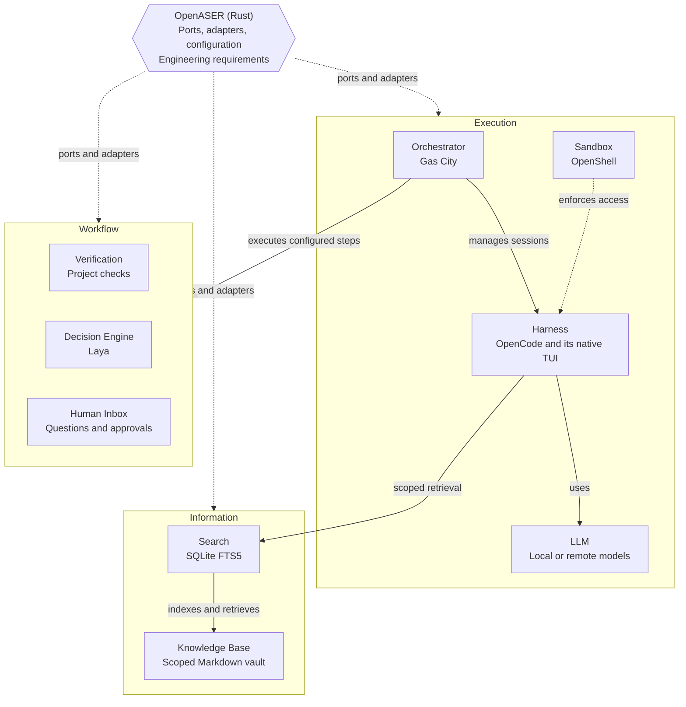

# OpenASER

Open Agentic Software Engineering Runtime.

**Status:** planning only. No runtime, adapters, or commands are implemented.
This README is the sole documentation and implementation plan. It uses all twelve
chapters of [arc42](https://arc42.org/overview/), with Implementation Plan as a
supplement, not a claim of formal standards compliance or architectural completeness.

Agreements define approved scope. **Open planning questions** identify decisions
still needed; **risks** identify unverified guarantees. Neither authorizes features,
implementation, or changes to existing agreements. Comparative research informs
questions, not requirements or an additional technology stack.

## 1. Introduction and Goals

OpenASER is a **Rust integration runtime** for coding agents. It defines required
behavior, configures the selected technologies, and connects them. Existing tools
do the heavy lifting; OpenASER does not recreate their engines.

The goals are an understandable interactive experience, explicit engineering and
security guarantees, and replaceable implementations behind narrow contracts.
Simple work should stay simple.

| Quality Goal | Meaning |
| --- | --- |
| **Understandable interaction** | Enter work through the harness's native TUI and answer questions without operating a fleet of waiting terminals. |
| **Enforced authority and scope** | Execution access, knowledge access, and publication stay within authorized boundaries. |
| **Trustworthy outcomes** | Keep worker completion, observed check results, assessments, acceptance, and authorization distinct. |
| **Thin, replaceable integration** | Reuse existing engines and support replacements that preserve the same behavioral contracts. |

The user supplies intent, scope, and additional authority. Implementation and
review use this document to distinguish agreements from unresolved questions.

**Open planning questions:** Which everyday work scenarios define success for the
first milestone? How should the quality goals be prioritized when they conflict?
What workload size and interaction expectations should guide later decisions?

## 2. Architecture Constraints

Use **Rust** and **hexagonal architecture: ports and adapters**. Reuse native
functionality rather than adding a duplicate scheduler, coding loop, task/session
registry, execution database, context engine, or test framework.

Only documented agreements authorize work. Unagreed behavior, including proposals
inside open planning questions, is outside approved scope. A risk can concern an
approved requirement; recording it does not make that requirement optional. Named
technologies are planned support commitments, not requirements to enable everything
for every task or implement it all in the first milestone. Concrete workflow design
is deferred.

OpenASER configuration uses **TOML only**. Configuration locations and ownership
are described in Crosscutting Concepts.

External tools are installed separately. Do not automatically install/update them
or silently continue with missing or incompatible prerequisites.

No implementation milestone is approved. Additional controllers, storage systems,
retries, recovery mechanisms, concurrency, or user interfaces do not become scope
because another framework provides them.

## 3. System Scope and Context

Users enter through the terminal and interact with the selected harness's native
TUI, initially OpenCode. OpenASER connects the orchestrator, harness, sandbox,
workflow mechanisms, and scoped knowledge access; it does not replace their
native engines or build a replacement chat TUI.

External tools retain their existing responsibilities and storage. The separate
Knowledge Base preserves reusable information and handoff context, not a second
authoritative record of orchestration state. The Human Inbox complements the
harness interface rather than becoming another execution controller.

| External Participant or System | Interaction With OpenASER |
| --- | --- |
| **User** | Starts an interactive session, supplies work through the native TUI, and answers questions or authorization requests. |
| **Execution tools** | Orchestrator-managed harness work under sandbox restrictions; their native state and lifecycle remain with their owners. |
| **Coding and decision inference** | Local or remote model access through the responsible integration and its permitted authentication. |
| **Project repository and checks** | Working files, Git history, project instructions, and supplied tests, builds, linters, or acceptance scripts. |
| **Knowledge vault** | Scoped reusable information and handoff context, optionally viewed or edited with Obsidian. |

These are responsibility and information boundaries, not a deployment topology.
ACP is the agreed initial managed-control protocol; other transports and process
locations are not established by this table.

**Open planning questions:** How does work entered in the native TUI become an
authorized orchestrator assignment? What distinguishes an information request,
an edit request, a review request, and additional authority? Are there actors
beyond the current user whose access or approval rights need definition?

## 4. Solution Strategy

OpenASER specifies required behavior and connects supported native mechanisms
through ports and adapters. The orchestrator owns workflow execution; the harness
owns its coding loop and native interaction. Security controls enforce access;
model assessments do not supply authority.

Keep authoritative execution state with its existing owners. Keep reusable
knowledge separate, retrieve context incrementally, and use actual check results
for Verification. Configure explicit workflow steps and decision mechanisms rather
than allowing another controller to invent the process.

Compatible combinations must satisfy the contract through supported mechanisms.
If that requires extensive patches, fragile interception, or a competing
controller, reconsider the integration rather than weaken safety or add machinery.
Implementations need not share directory layouts, worker roles, or scheduling
algorithms.

**Open planning questions:** What is the smallest end-to-end supported combination
that can demonstrate the agreed guarantees? Which responsibilities are satisfied
natively, which need configuration or an adapter, and which are unsupported?

## 5. Building Block View

A port defines required functionality, guarantees, and failure behavior. An
adapter connects that contract to supported tool interfaces, keeping tool-specific
commands, configuration, paths, and output handling out of shared logic.

The diagram shows required relationships, not a verified transport or startup
sequence. The groups are explanatory, not separate services or mandatory code
layers. This is an integration-level building block view, not an internal Rust
module hierarchy. Internal decomposition remains unselected until the necessary
contracts and an implementation milestone are agreed.

| Part | Owns | Does Not Own |
| --- | --- | --- |
| **OpenASER** | Engineering requirements, acceptance contract, ports, configuration, and connections | A duplicate scheduler, coding loop, or execution database |
| **Orchestrator** | Configured workflow execution, dependencies, interactive and managed sessions, workspace lifecycle, and execution bookkeeping | Authority to change requirements or publish without authorization |
| **Harness** | Native TUI, coding-agent loop, model integration, discovery tools, and internal subagents | Acceptance or authority beyond its assignment |
| **LLM** | Model responses | Permission enforcement or independent workflow control |
| **Sandbox** | Enforced access for the harness, its child processes, and working files | Engineering goals or correctness judgments |
| **Knowledge Base** | Decisions, supported findings, and handoff notes | Authoritative task or process status |
| **Search** | Rebuildable, scope-restricted lookup of knowledge notes | Creating knowledge, judging its truth, or granting access |
| **Verification** | Actual results of supplied checks | Inventing requirements or accepting a worker's assertion as evidence |
| **Decision Engine** | Bounded assessments at defined workflow nodes | Inventing transitions, overriding check facts, or authorizing actions |
| **Human Inbox** | Collecting requests and routing human responses | Another execution controller or security authority |

Supporting mechanisms remain with their existing owners:

- **Beads:** persistent task tracking used through the orchestrator's existing integration.
- **Git and worktrees:** history, change operations, and working files; workspace preparation and cleanup are orchestrator-owned.
- **Project-native tests, builds, linters, and acceptance scripts:** Verification through the agreed execution environment.
- **vLLM, Ollama, API keys, and supported subscription login:** coding inference through the harness's native configuration and authentication, including OpenCode's ChatGPT integration.
- **Filesystem, `rg`, Git, and optional Graphify:** harness discovery tools.
- **Markdown with YAML frontmatter, SQLite FTS5, and optional Obsidian:** knowledge content, derived search data, and a human view/editor respectively.

**Open planning questions:** What guarantees and failure behavior must each port
expose before implementation? Which behavior belongs in the common contract and
which details can remain implementation-specific?

## 6. Runtime View

These scenarios describe agreed behavior and ownership, not concrete APIs or a
complete workflow catalog.

### Interactive Entry

Running **`openaser`** prepares the agreed environment, requests the interactive
session through the orchestrator, and opens access to the harness's native TUI.
Users enter work there, not as long command-line arguments. The orchestrator owns
the lifecycle; OpenASER does not independently supervise another harness. A
harness conversation is not automatically an orchestrator session.

**`openaser init`** prepares a repository for later use. It does not install tools
or start a harness. Do not invent settings or directories to give initialization
something to do.

### Workflow Decisions and Verification

OpenASER establishes engineering requirements and acceptance semantics. Adapters
configure supported mechanisms to preserve them; the orchestrator executes the
configured process in its native way, not alongside another OpenASER controller.

Each workflow has explicit steps, permitted outcomes, and predefined transitions.
Reaching a decision node invokes its specified mechanism; a validated answer
selects the defined branch:

- **Deterministic checks:** observable facts, including supplied check results.
- **Decision Engine:** judgments that require assessment; Laya replaces Jev as the planned agentic implementation.
- **Human input:** intent, scope changes, or additional authority not already authorized.

Verification establishes results through actual execution. The orchestrator-managed
parent worker owns the outer assignment's claiming and completion protocol.
Harness subagents can delegate internally without becoming independent owners of
that assignment or its lifecycle.

Use ACP (Agent Client Protocol) for the initial Gas City-to-OpenCode managed
control integration. ACP is programmatic session control, not the native TUI
launch path; ports remain protocol-independent. Verify the complete connection,
sandbox preservation, workspace paths, and lifecycle against selected tool
versions. Protocol support alone is not end-to-end compatibility.

### Context Retrieval

The harness gathers context incrementally with its existing tools. OpenASER
supplies the authorized assignment, constraints, relevant instructions, and scoped
knowledge access. Sources include current files, Git, the Knowledge Base, relevant
orchestration state, and verification results, not whole repositories or execution
histories by default. Search supports scoped lookup, reading selected notes, and
following links within the permitted scope. Scope comes from execution context,
not the agent's guess. Laya is not invoked for every retrieval.

### Human Responses

The replaceable Human Inbox collects questions, choices, and approval requests
from agents and subagents at any level, rather than notification overlays. It
shows the source, question, and available answers; responses reach the originating
request. Offer session navigation where supported. Reading a request or sending
an ordinary message is not resolving it.

Agents investigate facts within their assignment. Human responses supply intent
or authority that existing requirements do not establish. The inbox routes the
response; agreed rules define its authorized scope and execution controls enforce
it. The inbox complements the native TUI; users must not have to operate a fleet
of waiting harness terminals.

### Scenario Coverage Gaps

**Open planning questions:** The following scenarios need agreed outcomes, not
new OpenASER mechanisms. Lifecycle and bookkeeping remain orchestrator-owned.

| Scenario | Outcome to Clarify |
| --- | --- |
| **Entry or preparation fails** | What happens to a partially prepared workspace or session when prerequisites, sandbox setup, authentication, or attachment fail? What does the user see? |
| **Work changes while running** | When does a correction or additional instruction take effect? How is a scope change distinguished from ordinary conversation? |
| **Pause, disconnect, or stop** | Does the request pause reasoning, stop a command, stop descendants, or end the assignment? How is a confirmed stop distinguished from work still running or an unknown outcome? |
| **A delegate needs human input** | How do source identity, pending questions, rejection, and responses survive nesting, an unavailable requester, or a changed assignment? |
| **A check or decision cannot finish** | What happens on timeout, interruption, invalid output, unavailable evidence, or changed work? Which predefined outcome applies without inventing a branch? |
| **An owner or connection fails** | How are failures and unknown outcomes reported? How does the user continue or abandon work without silently repeating effects after an acknowledgement was lost? |

Automatic retry, rollback, restart, rescheduling, and parallel execution are not
selected by listing these cases. A manual continuation or an explicitly unsupported
case may be sufficient for an approved milestone.

## 7. Deployment View

Ship OpenASER as its own executable with its implemented adapters. Compiled
library dependencies are distinct from independently installed external tools
and services. Check compatibility and report missing or incompatible prerequisites.

The user interacts through a terminal. Coding inference can be local or remote
through the harness; decision inference belongs to its own integration. Working
files must remain within enforced execution access. The Knowledge Base is a
separate vault, with a derived SQLite FTS5 index; Obsidian is not a runtime dependency.

The selected tools do not yet establish where each process or persistent store
runs. No local/remote service topology, container image, host platform matrix,
network policy, or runtime installation procedure is approved.

**Open planning questions:**

- Which hosts, processes, working directories, mounts, and endpoints form the first supported deployment? Where is the trusted control boundary relative to the harness and its descendants?
- Which tools and project prerequisites must already exist inside the execution environment rather than only on the host? How are tool and protocol versions checked together?
- Which files, network destinations, host services, and credentials are reachable from each execution path? How do native TUI and managed ACP access preserve the same restrictions?
- What survives process exit, sandbox loss, disconnection, or cleanup: working files, uncommitted changes, task state, conversation history, pending requests, and evidence? Who owns retention and deletion?

## 8. Crosscutting Concepts

### Configuration and Compatibility

OpenASER configuration uses TOML:

- User defaults: `$XDG_CONFIG_HOME/openaser/config.toml`, falling back to `~/.config/openaser/config.toml` when unset or empty.
- Repository settings: `.openaser/config.toml` at the repository root.

The user location follows XDG; the repository location is an OpenASER convention.
Harness configuration remains harness-owned. Supported combinations must preserve
the agreed contracts; protocol support alone does not establish compatibility.

**Open planning questions:** What are the configuration keys and precedence rules?
Which repository settings may affect behavior without widening user-authorized
access? How are conflicts, invalid settings, and unsupported combinations reported?

### Authority, Access, and Credentials

Human authorization remains separate from model assessments and check results.
No code publication, including hosting APIs, is allowed without explicit user
authorization across every execution path. Completion and acceptance do not grant
that permission. Worktrees are not sandboxes.

Reuse supported authentication, storage, and security mechanisms. Supply only
required access, not unrelated host credentials or the complete host environment.
Keep secrets out of project configuration, knowledge notes, and prompts.
Endpoints and authentication must be available within permitted execution.
Subscription login is not an API key; availability depends on the harness/provider.
Laya's inference belongs to its own integration, not assumed reuse of coding
subscription credentials.

**Open planning questions:** What exactly does each approval authorize, and when
does changed work or scope require another decision? Which supported controls
enforce it for shell commands, hosting APIs, background work, and descendants?
How are credential delivery, lifetime, revocation, and transcript exposure bounded?
Redaction alone does not prevent use of a credential.

### State, Knowledge, and Context

Code remains in Git/workspaces, execution results with the harness/orchestrator,
check results with Verification, and reusable findings with the Knowledge Base.
Required outputs remain accessible for review without an aggregate archive.

The Knowledge Base is one separate, centralized Markdown vault for project
decisions, constraints, conventions, supported findings, and handoff notes for
future or interrupted work. Use YAML frontmatter and supporting references.
Handoff notes explain the work; task status, ownership, dependencies, and execution
state remain with the orchestrator and task storage. Obsidian is optional, not a
runtime dependency.

Specific scope tags follow a consistent repository/branch hierarchy. Backlinks
express relationships, not permission to cross scopes. Use scoped notes rather
than copying whole collections for every branch. SQLite FTS5 stores a rebuildable
index derived from the vault, which remains the source of note content. The index
does not create knowledge or automatically include every match in context.

Writing or retrieving a note does not make its claims authoritative, replace
current code/evidence, or grant permission.

**Open planning questions:** How are scope membership, note provenance, uncertainty,
and superseded findings represented? What happens when the index is stale or
scope cannot be established? Which instructions are trusted, and how are their
precedence and applicability preserved during delegation, summarization, and
handoff? Could retrieved or agent-edited content change the rules used to judge it?

### Evidence and Limits

Lifecycle and execution bookkeeping remain with the orchestrator, not the vault
or a second OpenASER runtime store. Human responses return to their originating
requests. Actual check results remain distinct from model summaries or assessments.

Lifecycle failure scenarios are covered in [Runtime View](#6-runtime-view),
storage survival and retention in [Deployment View](#7-deployment-view), and
evidence freshness in [Quality Requirements](#10-quality-requirements).

**Open planning questions:** What native records let a user connect an assignment,
workspace, human decision, and check result? What limits are needed for command
duration, model usage, descendants, concurrent work, disk, and retained output?
What happens at a limit or when notification/telemetry fails?

No telemetry platform, new event database, resource defaults, or automatic recovery
policy is selected by these questions.

## 9. Architectural Decisions

These are existing agreements and their rationale, not new selections from the
comparative review. More detailed trade-offs remain open where evidence is missing.

| Decision | Rationale and Consequence |
| --- | --- |
| **Rust ports and adapters; thin integration** | Keep tool details outside shared engineering logic and reuse existing engines. A supported replacement must preserve behavior, not merely expose similar methods. |
| **Orchestrator owns execution; harness owns coding** | Avoid competing controllers and duplicate state. Gas City and OpenCode are the initial planned implementations. Their complete connection remains unverified. |
| **Native TUI plus complementary Human Inbox** | Preserve the harness interaction and collect nested requests without requiring a fleet of waiting terminals. ACP is managed control, not a replacement TUI launch path. |
| **Sandbox enforcement rather than workspace isolation alone** | Working-file separation does not establish access control. OpenShell is planned; the actual process, credential, and network boundaries still need validation. |
| **Explicit workflow nodes and bounded Laya assessments** | Keep transitions, observed facts, and authority separate from model judgment. Concrete workflow design and Laya's integration contract remain unresolved. |
| **Project-native Verification** | Reuse supplied checks and observe their actual results rather than build another test framework or trust completion claims. Passing checks is not blanket correctness. |
| **Central scoped vault and derived FTS5 index** | Keep reusable knowledge separate from execution state and avoid whole-collection branch copies. Tags and backlinks do not enforce access. |
| **TOML and separately installed tools** | Keep OpenASER configuration explicit and avoid automatic external installation. Actual settings and precedence remain unselected. |

**Open planning questions:** Which tool choices remain viable once the required
interaction and enforcement guarantees are checked together? What trade-offs
would justify reconsidering a planned integration rather than patching around it?

## 10. Quality Requirements

The agreed outcomes below refine the quality goals. The scenarios illustrate how
to challenge those agreements; they are not executable tests or verified results.

| Requirement | Scenario | Required Outcome |
| --- | --- | --- |
| **Explicit publication authorization** | A worker completes and attempts publication through a shell, hosting API, or delegated path without authorization. | No code publication without explicit user authorization across every execution path. Completion and acceptance do not grant that permission. |
| **Enforced execution access** | A harness or child process attempts access outside its permitted environment. | Sandbox restrictions cover the harness, its child processes, and working files. A separate worktree is not a sandbox or proof that changes are safe to integrate. |
| **Scoped knowledge access** | Retrieval or backlink traversal encounters another branch's local information. | Branch-local information does not flow into another branch's retrieved context. Tags describe scope; access controls enforce it. One vault does not expose all notes to every agent. |
| **Evidence-based acceptance** | A worker claims success without the supplied checks establishing it. | Verification reports actual check results, not a harness assertion. A worker finishing does not establish acceptance, and passing checks is not blanket correctness. |
| **Constrained decisions** | Laya returns an invalid answer or attempts to change the workflow or authority. | Laya cannot decide when it is called, invent branches, override check facts, or grant authority. Invalid responses cannot create transitions. |
| **Supported replaceability** | A planned implementation is replaced with another supported one. | A supported replacement satisfies the same contract without changing shared engineering logic. An adapter cannot manufacture missing guarantees. |
| **Correct human response routing** | A nested worker asks a question and the user reads or answers it. | Reading or ordinary messaging is not resolution. The actual response reaches the originating request; the inbox does not become an execution controller or security authority. |

Each approved milestone must verify the relevant requirements through the
supported combination, including failure paths, rather than infer them from the
presence of an adapter or a named technology.

**Open planning questions:** What evidence identifies the work that was checked
and the execution conditions? How are not-run, skipped, failed, interrupted,
timed-out, stale, unavailable, and truncated results distinguished? When do later
changes invalidate earlier results or assessments? What observable interaction,
performance, and resource expectations are necessary for the first milestone?
No numeric targets or reliability claims are agreed yet.

## 11. Risks and Technical Debt

No runtime code exists, so this section records planning and integration risks,
not an implemented technical-debt inventory. The required behavior above is not
proof that any selected combination already provides it.

| Risk | Consequence or Evidence Needed |
| --- | --- |
| **Native TUI and managed control are not yet connected end to end** | Verify that interactive and ACP-managed paths preserve orchestrator ownership, workspace identity, sandbox restrictions, and session lifecycle. |
| **Authority controls can miss an execution path** | Prompt rules, model risk labels, command interception, or parent-only approvals are not proof of publication and access enforcement for every path. |
| **Lifecycle outcomes are underspecified** | A paused agent may leave commands running; saved task or conversation state may coexist with lost working files. Stop, cleanup, and continuation need explicit meanings. |
| **Partial failure can leave effects with unknown outcomes** | Retrying an operation after losing its acknowledgement can repeat a write or external action. Native bookkeeping alone does not prove exactly-once effects. |
| **Knowledge or context may be stale, mis-scoped, or misleading** | Tags, summaries, and stored notes cannot replace enforced scope, current evidence, or instruction provenance. |
| **Evidence may not describe the current work** | Earlier passing checks, truncated output, or a model summary can obscure a changed artifact or incomplete verification. |
| **Tool capabilities and deployment assumptions can drift** | Planned versions and protocols need compatibility checks; managed-service features and shared interfaces do not establish equivalent guarantees. Laya's upstream interface remains unverified. |
| **Limits and retention are undefined** | Long-running work, growing output, inference usage, credentials, and cleanup may surprise the user until expectations and native controls are agreed. |

### Comparative Review

Reviewed OpenHands and LangChain Open SWE on **2026-10-02** using official
documentation and source. This was a read-only architecture review, not runtime
testing, a benchmark, or evidence that either stack meets OpenASER's contract.

- **OpenHands:** reviewed the current [Software Agent SDK and Agent Server](https://github.com/OpenHands/software-agent-sdk/tree/cc97bf234ea63b9276a7bd71ef81491f3849a7b2), not the archived legacy backend. Canvas, automation, sandbox services, and commercial offerings have distinct responsibilities; their guarantees are not interchangeable.
- **Open SWE:** reviewed [source at `9ee860eb4c7d0bc57a307a506938aa1ad84e50c5`](https://github.com/langchain-ai/open-swe/tree/9ee860eb4c7d0bc57a307a506938aa1ad84e50c5). This version uses Deep Agents and LangGraph, with LangSmith as the default sandbox/tracing provider, rather than the original planner/programmer architecture.

The comparison identifies questions within our existing responsibilities:

| Observed Lesson | OpenASER Planning Gap |
| --- | --- |
| [OpenHands action confirmation](https://docs.openhands.dev/sdk/guides/security) distinguishes risk classification from approval and documents a direct-tool-call bypass. | Identify the enforcing boundary and demonstrate coverage beyond the ordinary agent loop and parent session. |
| [OpenHands interruption](https://github.com/OpenHands/software-agent-sdk/blob/cc97bf234ea63b9276a7bd71ef81491f3849a7b2/openhands-sdk/openhands/sdk/conversation/impl/local_conversation.py) distinguishes pause from cancellation; worker-thread tools can outlive a cancelled run. | Define what a stop request actually stops and how incomplete or unknown outcomes reach the user. |
| [Open SWE sandbox lifecycle](https://github.com/langchain-ai/open-swe/blob/9ee860eb4c7d0bc57a307a506938aa1ad84e50c5/agent/sandboxes/lifecycle.py) distinguishes unreachable work from a deleted environment rather than silently replacing every failed connection. | Clarify what work must survive and when replacement, cleanup, or continuation needs a user decision. |
| [Open SWE access and safety](https://github.com/langchain-ai/open-swe/blob/9ee860eb4c7d0bc57a307a506938aa1ad84e50c5/README.md#control-and-safety) distinguishes repository routing from credential scope and disclaims universal shell/API write coverage. | Keep knowledge scope, execution access, credential authority, and publication permission separate. |
| [Open SWE delivery instructions](https://github.com/langchain-ai/open-swe/blob/9ee860eb4c7d0bc57a307a506938aa1ad84e50c5/agent/resources/prompts/system/commit-pr.md) prefer pushing and PR delivery, while [customization](https://github.com/langchain-ai/open-swe/blob/9ee860eb4c7d0bc57a307a506938aa1ad84e50c5/docs/CUSTOMIZATION.md#6-middleware) has no after-agent PR-opening backstop. | Neither automated delivery nor prompt-only restraint is our authority policy. Preserve explicit publication authorization independently of worker completion. |

Other relevant questions concern intervention semantics, delegated approvals,
instruction trust, context freshness, evidence provenance, resource limits, and
native records. They are recorded in Runtime View, Crosscutting Concepts, and
Quality Requirements rather than becoming a competitor feature checklist.

No switch of orchestrator, harness, sandbox, knowledge storage, or decision engine
is approved by this review. Automatic PRs, cloud deployment, dashboards, team
collaboration, new queues, and recovery machinery remain outside agreed scope.

## 12. Glossary

Use these terms consistently in prose, tables, and diagrams. Building blocks and
capabilities use the labels in the responsibility table above.

| Term | Meaning |
| --- | --- |
| **Role** | A responsibility, not necessarily a separate process or service. |
| **Port** | The contract for required functionality, guarantees, and failure behavior. |
| **Adapter** | Tool-specific integration connecting a port to an implementation. |
| **Implementation** | The concrete technology or mechanism fulfilling the contract. |
| **Workflow** | Explicit steps, decision mechanisms, permitted outcomes, and transitions executed through the orchestrator. |
| **Assessment** | A bounded judgment, not an observed check result or authorization. |
| **Check result** | An observed result from an executed check. |
| **Acceptance** | Meeting the agreed requirements for produced work; not merely worker completion. |
| **Authorization** | Explicit permission for a defined scope of actions. |
| **Orchestrator session** | Managed harness execution under the orchestrator's lifecycle ownership. |
| **Harness conversation** | The harness's interaction context, not automatically a separate orchestrator session. |

## Implementation Plan

This is an arc42 supplement. Planning questions guide discussion; they are not a
backlog authorized for implementation.

Start with the blocking interaction and authority questions: how native-TUI work
becomes an orchestrator assignment, how TUI and managed control preserve sandbox
restrictions, and how publication authorization is enforced. Then clarify
lifecycle outcomes and acceptance evidence for the intended work. Use documentation
and source research to assess feasibility before proposing a milestone; any
runtime experiment requires its own approval. Not every planning question must
be resolved before a small milestone whose behavior and exclusions are explicit.

1. **Clarify:** discuss each responsibility, its need, owner, interactions, guarantees, and exclusions. Keep accepted agreements distinct from open planning questions and unverified claims.
2. **Approve one milestone:** record its behavior, necessary capabilities, acceptance checks, and exclusions before coding. Do not scaffold the whole architecture.
3. **Validate integrations:** use narrow contracts and supported interfaces. A new implementation needs an adapter satisfying the contract, not vendor-specific branches in the core.
4. **Implement only that scope:** reuse native functionality. No speculative helpers, dependencies, services, retries, parallelism, recovery, or commands.
5. **Verify and ask:** test acceptance and failure cases, including false completion claims. Report results and ask before continuing or expanding scope.

**Current milestone:** none approved. Current work: architecture clarification.
