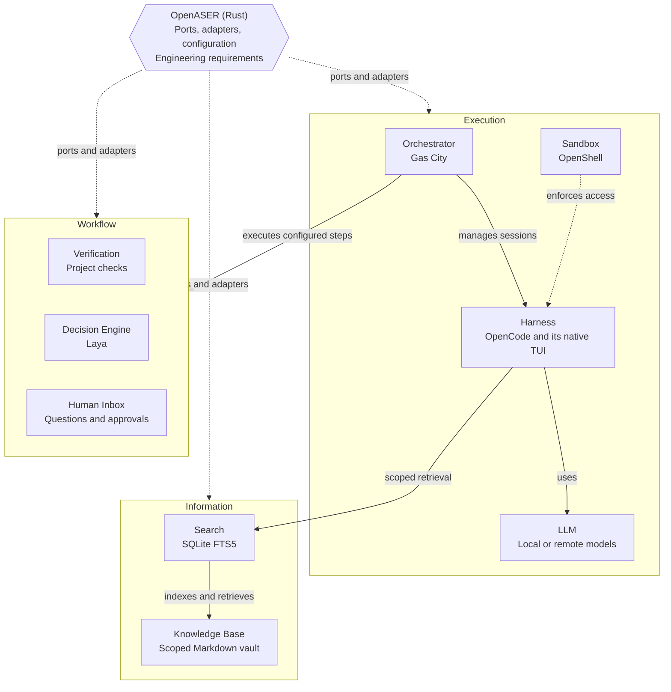

# OpenASER

Open Agentic Software Engineering Runtime.

OpenASER is a **Rust integration runtime** for coding agents. It defines the
required behavior, configures the selected technologies, and connects them.
Existing tools do the heavy lifting; OpenASER does not recreate their engines.
Simple work should stay simple.

**Status:** planning only. No runtime, adapters, or commands are implemented.
This README records agreed decisions and the implementation plan.
[OpenASER.md](OpenASER.md) remains unchanged as background, not authorization to implement its proposals.

## Architecture

OpenASER uses **hexagonal architecture: ports and adapters**. A port defines
required functionality, guarantees, and failure behavior. An adapter connects
that contract to a tool's supported interfaces and keeps tool-specific details
out of shared logic.

The diagram shows required relationships, not a verified transport or startup
sequence. The groups are explanatory, not separate services or mandatory code
layers. The named technologies are planned support commitments, not requirements
to enable everything for every task or implement it all in the first milestone.

## Responsibilities

| Part | Owns | Does Not Own |
| --- | --- | --- |
| **OpenASER** | Engineering requirements, acceptance contract, ports, configuration, and connections | A duplicate scheduler, coding loop, or execution database |
| **Orchestrator** | Configured workflow execution, dependencies, interactive and managed sessions, workspace lifecycle, and execution bookkeeping | Authority to change requirements or publish without authorization |
| **Harness** | Native TUI, coding-agent loop, model integration, discovery tools, and internal subagents | Acceptance or authority beyond its assignment |
| **LLM** | Model responses | Permission enforcement or independent workflow control |
| **Sandbox** | Enforced access for the harness, its child processes, and working files | Engineering goals or correctness judgments |
| **Knowledge Base** | Decisions, supported findings, and handoff notes | Authoritative task or process status |
| **Search** | Rebuildable, scope-restricted lookup of knowledge notes | Creating knowledge, judging its truth, or granting access |
| **Verification** | Actual results of supplied checks | Inventing requirements or accepting a worker's assertion as evidence |
| **Decision Engine** | Bounded assessments at defined workflow nodes | Inventing transitions, overriding check facts, or authorizing actions |
| **Human Inbox** | Collecting requests and routing human responses | Another execution controller or security authority |

Supporting mechanisms remain with their existing owners:

- **Beads:** persistent task tracking used through the orchestrator's existing integration.
- **Git and worktrees:** history, change operations, and working files; workspace preparation and cleanup are orchestrator-owned.
- **Project-native tests, builds, linters, and acceptance scripts:** Verification through the agreed execution environment, not a new test framework.
- **vLLM, Ollama, API keys, and supported subscription login:** coding inference through the harness's native configuration and authentication, including OpenCode's ChatGPT integration.
- **Filesystem, `rg`, Git, and optional Graphify:** harness discovery tools, not a separate context engine.
- **Markdown with YAML frontmatter, SQLite FTS5, and optional Obsidian:** knowledge content, derived search data, and a human view/editor respectively.

Code remains in Git/workspaces, execution results with the harness/orchestrator,
check results with Verification, and reusable findings with the Knowledge Base.
Required outputs must remain accessible for review; no aggregate archive or
duplicate task/session registry is introduced.

## Workflow and Acceptance

OpenASER establishes engineering requirements and acceptance semantics. Adapters
configure supported mechanisms to preserve them; the orchestrator executes the
configured process in its native way, not alongside another OpenASER controller.
Concrete workflow design is deferred.

Each workflow has explicit steps, permitted outcomes, and predefined transitions.
Reaching a decision node invokes its specified mechanism; a validated answer
selects the defined branch:

- **Deterministic checks:** observable facts, including supplied check results.
- **Decision Engine:** judgments that require assessment; Laya replaces Jev as the planned agentic implementation.
- **Human input:** intent, scope changes, or additional authority not already authorized.

Laya cannot decide when it is called, invent branches, or substitute judgment for
check results or authorization. Invalid responses cannot create transitions.
Verification uses actual execution, not a harness's claim that checks passed.
Check results establish what was checked, not blanket correctness. A worker
finishing does not itself establish acceptance.

The orchestrator-managed parent worker owns the outer assignment's claiming and
completion protocol. Harness subagents can delegate internally without becoming
independent owners of that assignment or its lifecycle.

Use ACP (Agent Client Protocol) for the initial Gas City-to-OpenCode managed
control integration. ACP is programmatic session control, not the native TUI
launch path; ports remain protocol-independent. Verify the complete connection,
sandbox preservation, workspace paths, and lifecycle against selected tool
versions. Protocol support alone is not end-to-end compatibility.

## Knowledge Base and Context

Keep one separate, centralized Markdown vault for project decisions, constraints,
conventions, supported findings, and handoff notes for future or interrupted work.
Use YAML frontmatter and supporting references. Writing a claim does not make it
authoritative. Handoff notes explain the work; task status, ownership,
dependencies, and execution state remain with the orchestrator and task storage.

Specific scope tags follow a consistent repository/branch hierarchy. Backlinks
express relationships, not permission to cross scopes. Use scoped notes rather
than copying whole collections for every branch. Branch-local information must
not flow into another branch's retrieved context. Tags describe scope; access
controls enforce it. One vault does not give every agent access to all its files.

Search supports scoped lookup, reading selected notes, and following links within
the permitted scope. SQLite FTS5 stores a rebuildable index derived from the
vault, which remains the source of note content. The index does not automatically
include every match in context. Obsidian is optional, not a runtime dependency.

The harness gathers context incrementally with its existing tools. OpenASER
supplies the authorized assignment, constraints, relevant instructions, and scoped
knowledge access. Sources include current files, Git, the Knowledge Base,
relevant orchestration state, and verification results, not whole repositories or
execution histories by default. Scope comes from execution context, not the
agent's guess. Retrieved notes neither replace current code/evidence nor grant
authority. Laya is not invoked for every retrieval.

## Human Inbox and Security

The replaceable Human Inbox collects questions, choices, and approval requests
from agents and subagents at any level, rather than notification overlays. It
shows the source, question, and available answers; responses reach the originating
request. Offer session navigation where supported. Reading a request or sending
an ordinary message is not resolving it. The inbox complements the native TUI,
and users must not have to operate a fleet of waiting harness terminals.

Agents investigate facts within their assignment. Human responses supply intent
or authority that existing requirements do not establish. The inbox routes the
response; agreed rules define its authorized scope and execution controls enforce it.

- **No automatic publication:** remote code publication, including hosting APIs, requires explicit user authorization across every execution path. Completion and acceptance do not grant that permission.
- **Enforced access:** sandbox restrictions cover the harness and its children. A separate worktree is not a sandbox and does not prove changes are safe to integrate.
- **Deliberate credentials:** reuse supported authentication, storage, and security mechanisms. Supply only required access, not unrelated host credentials or the complete host environment. Keep secrets out of project configuration, knowledge notes, and prompts.
- **Inference boundaries:** endpoints and authentication must be available within permitted execution. Subscription login is not an API key, and availability depends on the harness/provider. Laya's inference belongs to its own integration, not assumed reuse of coding subscription credentials.

## Usage and Configuration

Running **`openaser`** prepares the agreed environment, requests the interactive
session through the orchestrator, and opens access to the harness's native TUI,
initially OpenCode. Users enter work there, not as long command-line arguments.
OpenASER does not independently supervise another harness or build a replacement
chat TUI. A harness conversation is not automatically an orchestrator session.

**`openaser init`** prepares a repository for later use. It does not install tools
or start a harness. Do not invent settings or directories to give initialization
something to do.

OpenASER configuration uses **TOML only**:

- User defaults: `$XDG_CONFIG_HOME/openaser/config.toml`, falling back to `~/.config/openaser/config.toml` when unset or empty.
- Repository settings: `.openaser/config.toml` at the repository root.

The user location follows XDG; the repository location is an OpenASER convention.
Harness configuration remains harness-owned.

Ship OpenASER as its own executable with its implemented adapters. Compiled
library dependencies are distinct from independently installed external tools
and services. Do not automatically install/update those tools. Check compatibility
and report missing or incompatible prerequisites instead of silently proceeding.

## Implementation Plan

Only documented agreements authorize work; anything absent is outside approved
scope. Use the same terminology in prose, tables, and diagrams. A role is a
responsibility, a port is its required contract, and an adapter is its connection
to an implementation, not interchangeable names for services.

1. **Clarify:** discuss each responsibility, its need, owner, interactions, guarantees, and exclusions. Record only agreements, not proposals or open questions.
2. **Approve one milestone:** record its behavior, necessary capabilities, acceptance checks, and exclusions before coding. Do not scaffold the whole architecture.
3. **Validate integrations:** use narrow contracts and supported interfaces. Selecting a supported replacement must not change shared engineering logic; a new implementation needs an adapter satisfying the contract, not vendor-specific branches in the core.
4. **Implement only that scope:** reuse native functionality. No speculative helpers, dependencies, services, retries, parallelism, recovery, or commands.
5. **Verify and ask:** test acceptance and failure cases, including false completion claims. Report results and ask before continuing or expanding scope.

An adapter cannot manufacture missing guarantees. Compatible combinations must
satisfy the contract. If that requires extensive patches, fragile interception,
or a competing controller, reconsider the integration rather than weaken safety
or add machinery. Implementations need not share directory layouts, worker roles,
or scheduling algorithms.

**Current milestone:** none approved. Current work: architecture clarification.
